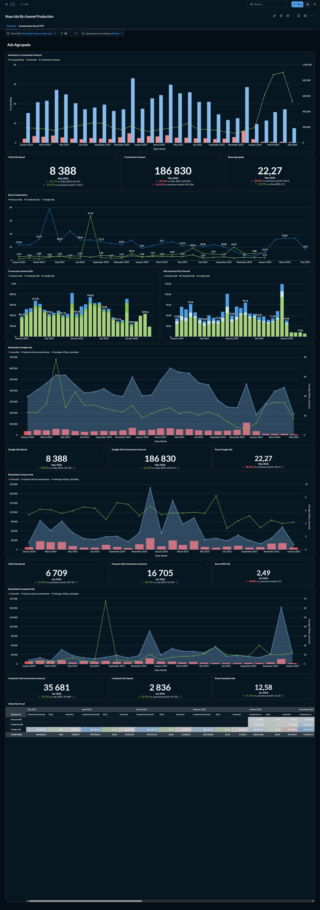
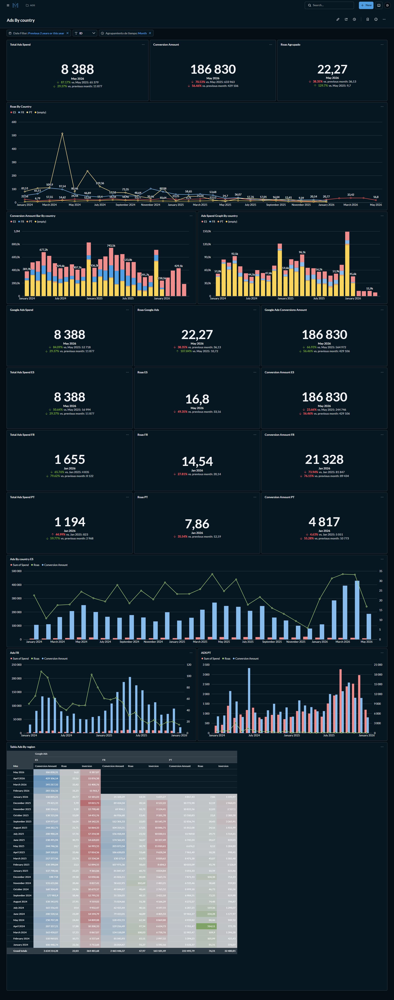
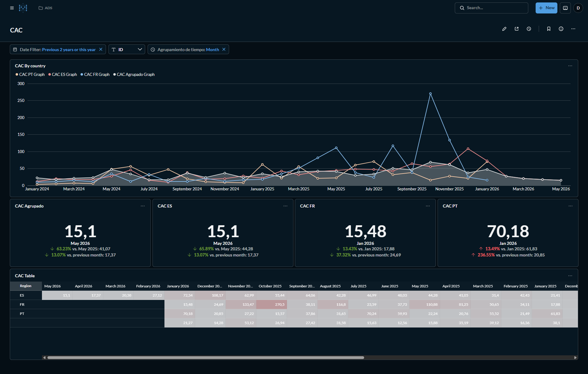
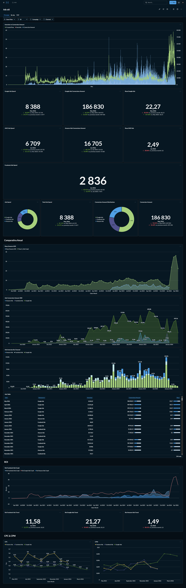
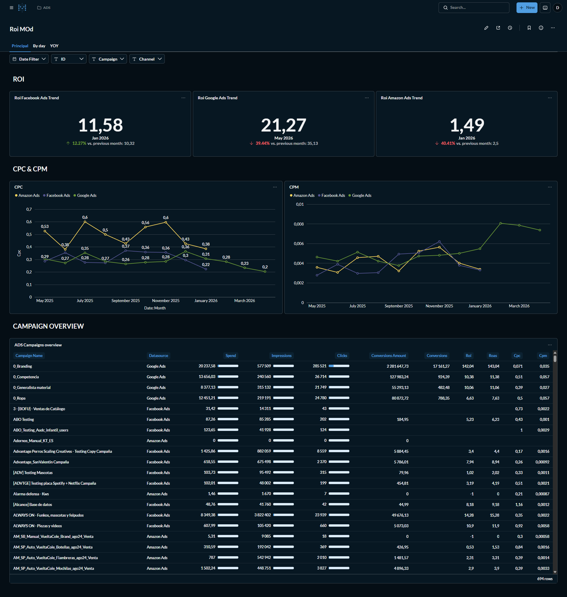

# 📈 Multi-Channel Ads Performance Dashboard — Metabase

> A 5-dashboard **Metabase** analytics suite built on PostgreSQL — tracking ROAS, ROI, CAC, CPC, CPM, and conversion performance across Google Ads, Facebook Ads, and Amazon Ads for a European e-commerce client operating in Spain, France, and Portugal.

---

## 📌 Project Overview

The client was running paid advertising across three platforms (Google Ads, Facebook Ads, Amazon Ads) and three markets (ES, FR, PT) simultaneously — with no consolidated view of how each channel and country was actually performing. Platform dashboards show siloed numbers. There was no way to compare ROAS across channels, track CAC by market, or see ROI trends over time in a single place.

I built a suite of Metabase dashboards connected to their PostgreSQL backend, pulling ad spend, impressions, clicks, conversions, and revenue data across all channels and markets — and turning it into a structured, filterable reporting system updated monthly.

**Markets:** Spain (ES) · France (FR) · Portugal (PT)
**Channels:** Google Ads · Facebook Ads · Amazon Ads
**Stack:** Metabase · PostgreSQL · Custom SQL
**Language:** Spanish (client-facing dashboard)
**Filters:** Date range · Country · Campaign · Channel · Time grouping

---

## 📄 Dashboard Suite

### 1. ROAS Ads By Channel — Production View

The primary ads performance dashboard. Tracks grouped ROAS, total ad spend, and conversion amounts across all three channels — with individual channel sections for Google Ads, Amazon Ads, and Facebook Ads, plus a full annual comparison table.



**Key metrics visible (May 2026):**
- Total ad spend: **8,388** · Conversion amount: **186,830** · Grouped ROAS: **22.27**
- **Google Ads:** Spend 8,388 · Conversions 186,830 · ROAS 22.27
- **Amazon Ads:** Spend 6,709 · Conversions 16,705 · ROAS 2.49
- **Facebook Ads:** Spend 2,836 · Conversions 35,681 · ROAS 12.58
- ROAS trend chart going back to January 2024 across all 3 channels
- Grouped ROAS comparative line chart: Amazon vs Facebook vs Google
- Conversion amount and ad investment by channel — stacked bar charts (2024–2026)
- Full annual sales table: spend, conversions, and ROAS by channel and month

---

### 2. Ads By Country — Geographic Performance Breakdown

Breaks down all ad metrics by market (ES, FR, PT) — spend, ROAS, and conversions for each country with MoM and YoY comparisons, plus a cross-country monthly data table.



**Key metrics visible:**
- **Spain (ES):** Spend 8,388 · ROAS 16.8 · Conversions 186,830
- **France (FR):** Spend 1,655 · ROAS 14.54 · Conversions 21,328
- **Portugal (PT):** Spend 1,194 · ROAS 7.86 · Conversions 4,817
- ROAS by country trend line chart (Jan 2024 – May 2026)
- Conversion amount and ad spend bar charts by country
- Full monthly breakdown table: spend, conversions, ROAS · ES / FR / PT side by side

---

### 3. CAC — Customer Acquisition Cost by Market

A dedicated CAC tracking dashboard. Monitors cost per acquired customer across all three markets over time, surfacing volatility and trend direction by region.



**Key metrics visible (most recent period):**
- **Grouped CAC:** 15.1 — down 63.23% vs May 2025 (41.07)
- **Spain (ES) CAC:** 15.1 — down 65.89% vs May 2025
- **France (FR) CAC:** 15.48 — down 13.43% vs Jan 2025
- **Portugal (PT) CAC:** 70.18 — up 13.49% vs Jan 2025
- Multi-line trend chart: CAC by country from Jan 2024 – May 2026 (PT spike visible at Nov 2025: 270)
- CAC table: monthly values by region going back 18+ months

---

### 4. Ads Old — Full Historical Ads View

A comprehensive historical dashboard covering the full lifetime of ad activity across all channels — including ROI trends, CPC, CPM, and a campaign-level data table. Filterable by campaign and channel in addition to date.



**Key metrics visible:**
- Historical ROAS comparison: Amazon vs Facebook vs Google (Apr 2020 – May 2026)
- Conversion amount by channel over time — stacked area chart
- Investment by channel — stacked bar chart by month
- **ROI by channel:** Facebook ROI 11.58 · Google ROI 21.27 · Amazon ROI 1.49
- CPC trend: Amazon, Facebook, Google — monthly from May 2020
- CPM trend: Amazon, Facebook, Google — monthly
- Ads Table: campaign-level spend, impressions, conversions, and ROAS

---

### 5. ROI MOd — ROI, CPC & CPM + Campaign Table

A focused ROI dashboard with a full campaign-level breakdown table (694 campaigns). Shows channel-level ROI trends, CPC and CPM efficiency metrics, and a scrollable campaign overview with spend, impressions, clicks, conversions, ROI, ROAS, CPC, and CPM per campaign.



**Key metrics visible:**
- **Facebook Ads ROI:** 11.58 (+12.27% vs previous month)
- **Google Ads ROI:** 21.27 (−39.44% vs previous month)
- **Amazon Ads ROI:** 1.49 (−40.41% vs previous month)
- CPC chart: Amazon ~0.2 · Facebook ~0.3 · Google ~0.23 (May 2025 – March 2026)
- CPM chart: all three channels compared monthly
- Campaign overview table (694 rows): Campaign · Datasource · Spend · Impressions · Clicks · Conversion Amount · Conversions · ROI · ROAS · CPC · CPM

---

## 🛠️ How It Was Built

| Layer | Detail |
|---|---|
| **Data sources** | Google Ads · Facebook Ads · Amazon Ads |
| **Backend** | PostgreSQL database |
| **BI tool** | Metabase (hosted) |
| **Query method** | Custom SQL for every card and dashboard |
| **Markets** | Spain (ES) · France (FR) · Portugal (PT) |
| **Filters** | Date · Country · Campaign · Channel · Time grouping |
| **Comparisons** | MoM · YoY · vs. same period prior year |
| **Dashboard language** | Spanish (client-facing) |

---

## 📁 Dashboard Structure

```
ADS Collection/
├── ROAS Ads By Channel – Production   # Primary grouped ROAS view by channel
├── Ads By Country                     # Geographic breakdown — ES / FR / PT
├── CAC                                # Customer acquisition cost by market
├── Ads Old                            # Full historical view — ROI, CPC, CPM
└── ROI MOd                            # ROI + campaign-level table (694 campaigns)
```

---

## 💡 What This Enabled

Before this suite, the team had no way to compare ROAS across Google, Facebook, and Amazon in a single view — or to see whether CAC was improving or deteriorating by country. These dashboards gave the marketing team a consolidated, live view of paid performance across all channels and markets, updated monthly, without manual spreadsheet work.

---

## 👤 About

Built by **[Md Arshad Ahammed (Ash)](https://arshadadvisory.com)** — Marketing Performance Analyst specialising in Metabase, SQL, GA4, GTM, and paid media analytics.

📬 [arshadadvisory.com](https://arshadadvisory.com)
